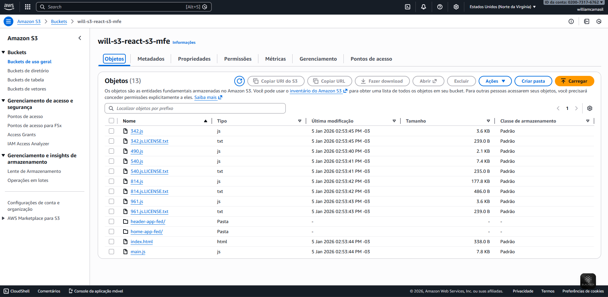

# Objetivo

Esse projeto, tem como objetivo criar um projeto de microfrontends usando module federation e conexão com a AWS.

[Referência](https://dev.to/samhoooo/micro-frontend-with-module-federation-in-react-3g4m)

## Como criar um projeto MicroFrontEnd com Módulo Federation e React

Execute os seguintes comandos para criar os microfrontends:
```
npx create-react-app home-app // criar o projeto HOME
npx create-react-app header-app // criar o projeto HEADER
```

Para fazer a instalação do Webpack 5 e dependências relacionadas, execute o seguinte comando:
```
npm install -–save-dev webpack webpack-cli html-webpack-plugin webpack-dev-server babel-loader css-loader
```
Ou esse comando se estiver usando yarn:
```
yarn add -D webpack webpack-cli html-webpack-plugin webpack-dev-server babel-loader css-loader
```

### Configuração do projeto inicial

Customize o arquivo App.js para diferenciar entre os MFEs do que já foi criado inicialmente.

### Criando o arquivo Webpack

Dentro da pasta root do projeto <b>home</b> e <b>header</b> crie um arquivo com nome webpack.config.js e insira o seguinte código:
```
//home-app/webpack.config.js
const HtmlWebpackPlugin = require("html-webpack-plugin");

module.exports = {
    entry: "./src/index",
    mode: "development",
    devServer: {
        port: 3000,  // port 3001 for header-app
    },
    module: {
        rules: [
            {
                test: /\.(js|jsx)?$/,
                exclude: /node_modules/,
                use: [
                    {
                    loader: "babel-loader",
                    options: {
                        presets: ["@babel/preset-env", "@babel/preset-react"],
                    },
                    },
                ],
            },
            {
                test: /\.css$/i,
                use: ["style-loader", "css-loader"],
            },
        ],
    },
    plugins: [
        new HtmlWebpackPlugin({
            template: "./public/index.html",
        }),
    ],
    resolve: {
        extensions: [".js", ".jsx"],
    },
    target: "web",
};
```
OBS.: altere a porta no devServer do arquivo header para 3001

Modifique os arquivos header-app/src/index.js & home-app/src/index.js:

```
import React from 'react';
import ReactDOM from 'react-dom/client';
import './index.css';
import App from './App';

const root = ReactDOM.createRoot(document.getElementById('app'));
root.render(
  <React.StrictMode>
    <App />
  </React.StrictMode>
);
Modify header-app/public/index.html & home-app/public/index.html:

<!DOCTYPE html>
<html lang="en">
  <head>
    <meta charset="UTF-8" />
    <meta http-equiv="X-UA-Compatible" content="IE=edge" />
    <meta name="viewport" content="width=device-width, initial-scale=1.0" />
    <title>React with Webpack</title>
  </head>
  <body>
    <div id="app"></div>

    <script src="main.js"></script>
  </body>
</html>
```
Altere os scripts header-app/package.json & home-app/package.json:

```
"scripts": {
    "start": "webpack serve",
    "build": "webpack --mode production",
 },
 ```

 Rode o projeto:
 ```
 npm run start
 ```

### Configurando o Module Federation

Crie um arquivo com nome "Entry" nos MFEs header-app/entry.js and home-app/entry.js, e adicione o seguinte comando:

```
import('./index.js')
```

Modifique o arquivo entry em header-app/webpack.config.js e home-app/webpack.config.js

```
module.exports = {
    entry: "./src/entry.js",
    //...
}
```

Agora precisamos expor o Header para o home-app usar, no nosso header-app/webpack.config.js:

```
// header-app/webpack.config.js
const HtmlWebpackPlugin = require("html-webpack-plugin");
// import ModuleFederationPlugin from webpack
const ModuleFederationPlugin = require("webpack/lib/container/ModuleFederationPlugin"); 
// import dependencies from package.json, which includes react and react-dom
const { dependencies } = require("./package.json");
```
```
module.exports = {
    //...
    plugins: [
        //...
        new ModuleFederationPlugin({
            name: "HeaderApp",  // This application named 'HeaderApp'
            filename: "remoteEntry.js",  // output a js file
            exposes: { // which exposes
              "./Header": "./src/App",  // a module 'Header' from './src/App'
            },
            shared: {  // and shared
              ...dependencies,  // some other dependencies
              react: { // react
                singleton: true,
                requiredVersion: dependencies["react"],
              },
              "react-dom": { // react-dom
                singleton: true,
                requiredVersion: dependencies["react-dom"],
              },
            },
        }),
    ],
};
```
Abra o app, navegue até http://localhost:3001/remoteEntry.js. Este é um manifesto de todos os módulos expostos pela aplicação do cabeçalho.

Agora precisamos adicionar o ModuleFederationPlugin ao home-app/webpack.config.js:

```
// home-app/webpack.config.js
const HtmlWebpackPlugin = require("html-webpack-plugin");
// import ModuleFederationPlugin from webpack
const ModuleFederationPlugin = require("webpack/lib/container/ModuleFederationPlugin");
// import dependencies from package.json, which includes react and react-dom
const { dependencies } = require("./package.json");

module.exports = {
    //...
    plugins: [
        //...
        new ModuleFederationPlugin({
            name: "HomeApp",  // This application named 'HomeApp'
            // This is where we define the federated modules that we want to consume in this app. 
            // Note that we specify "Header" as the internal name 
            // so that we can load the components using import("Header/"). 
            // We also define the location where the remote's module definition is hosted: 
            // Header@[http://localhost:3001/remoteEntry.js]. 
            // This URL provides three important pieces of information: the module's name is "Header", it is hosted on "localhost:3001", 
            // and its module definition is "remoteEntry.js".
            remotes: { 
                "HeaderApp": "HeaderApp@http://localhost:3001/remoteEntry.js",            
            },
            shared: {  // and shared
                ...dependencies,  // other dependencies
                react: { // react
                    singleton: true,
                    requiredVersion: dependencies["react"],
                },
                "react-dom": { // react-dom
                    singleton: true,
                    requiredVersion: dependencies["react-dom"],
                },
            },
        }),
    ],
};
```

Modifique home-app/src/App.js para usar o componente Header do app remoto:

```
import React, { lazy, Suspense } from 'react'; // Must be imported for webpack to work
import './App.css';

const Header = lazy(() => import('HeaderApp/Header'));

function App() {
  return (
    <div className="App">
      <Suspense fallback={<div>Loading Header...</div>}>
        <Header />
      </Suspense>
      <div className="container">Demo home page</div>
    </div>
  );
}

export default App;
```

## Deploy na AWS

[Referência](https://www.youtube.com/watch?v=N-gzLmYLRRk)

Para iniciar é necessário ter acesso aos serviços da AWS, ao acessar busque pelo serviço do S3.

Crie um Bucket sem mexer nas configurações iniciais, após criar o bucket, abra o bucket criado e acesse o menu de propriedades do bucket. Procure por Hospedagem de site estático no final da tela, clique em editar, ative a hospedagem de site estático, adicione index.html no documento de índice e salve as mudanças. No mesmo local onde foi clicado em propriedades do bucket, procure a aba permissões, procure por Bloquear acesso público (configurações do bucket) e clique em Editar, desabilite a opção de bloquear todo o acesso público e salve as alterações, ao retornar para o mesma aba de permissões, procure por política do bucket e crie uma politica de acordo com o seu bucket, no nosso caso, ficou assim:

```
{
    "Version": "2012-10-17",
    "Id": "GetObject",
    "Statement": [
        {
            "Sid": "Stmt123456789",
            "Effect": "Allow",
            "Principal": "*",
            "Action": "s3:GetObject",
            "Resource": "arn:aws:s3:::will-s3-react-s3-mfe/*"
        }
    ]
}
```

OBS.: will-s3-react-s3-mfe nome do bucket

Após adicionar a politica, clique em salvar. Feito essas configurações o bucket estará pronto para receber o build do projeto. 

### Subindo o projeto para o bucket configurado
Agora precisamos gerar o build do projeto seja manual ou automatizado.
Para isso precisamos fazer algumas configurações para subir os projetos.

Para iniciar, vamos criar um novo arquivo em ambos os projetos: webpack.prod.js, modificar o package.json e fazer algumas modificações.

No projeto Home crie o webpack.prod.js e adicione o seguinte código:

```
// home-app/webpack.config.js
const HtmlWebpackPlugin = require("html-webpack-plugin");
// import ModuleFederationPlugin from webpack
const ModuleFederationPlugin = require("webpack/lib/container/ModuleFederationPlugin");
// import dependencies from package.json, which includes react and react-dom
const { dependencies } = require("./package.json");

module.exports = {
  entry: "./src/entry.js",
  mode: "production",
  module: {
    rules: [
      {
        test: /\.(js|jsx)?$/,
        exclude: /node_modules/,
        use: [
          {
            loader: "babel-loader",
            options: {
              presets: ["@babel/preset-env", "@babel/preset-react"],
            },
          },
        ],
      },
      {
        test: /\.css$/i,
        use: ["style-loader", "css-loader"],
      },
    ],
  },
  plugins: [
    new HtmlWebpackPlugin({
      template: "./public/index.html",
    }),
    new ModuleFederationPlugin({
      name: "HomeApp", // This application named 'HomeApp'
      // This is where we define the federated modules that we want to consume in this app.
      // Note that we specify "Header" as the internal name
      // so that we can load the components using import("Header/").
      // We also define the location where the remote's module definition is hosted:
      // Header@[http://localhost:3001/remoteEntry.js].
      // This URL provides three important pieces of information: the module's name is "Header", it is hosted on "localhost:3001",
      // and its module definition is "remoteEntry.js".
      remotes: {
        HeaderApp: "HeaderApp@http://localhost:3001/remoteEntry.js",
      },
      shared: {
        // and shared
        ...dependencies, // other dependencies
        react: {
          // react
          singleton: true,
          requiredVersion: dependencies["react"],
        },
        "react-dom": {
          // react-dom
          singleton: true,
          requiredVersion: dependencies["react-dom"],
        },
      },
    }),
  ],
  resolve: {
    extensions: [".js", ".jsx"],
  },
  target: "web",
};
```
OBS.: Se comparado com o webpack.config.js, nesse arquivo de prod, removemos o objeto devServer e o mode colocamos production, mais a frente iremos alterar o objeto remotes para linkar com a url vinda da AWS.

No projeto do Header, crie o arquivo webpack.prod.js e adicione o código:

```
// header-app/webpack.config.js
const HtmlWebpackPlugin = require("html-webpack-plugin");
// import ModuleFederationPlugin from webpack
const ModuleFederationPlugin = require("webpack/lib/container/ModuleFederationPlugin"); 
// import dependencies from package.json, which includes react and react-dom
const { dependencies } = require("./package.json");

module.exports = {
  entry: "./src/entry.js",
  mode: "production",
  module: {
    rules: [
      {
        test: /\.(js|jsx)?$/,
        exclude: /node_modules/,
        use: [
          {
            loader: "babel-loader",
            options: {
              presets: ["@babel/preset-env", "@babel/preset-react"],
            },
          },
        ],
      },
      {
        test: /\.css$/i,
        use: ["style-loader", "css-loader"],
      },
    ],
  },
  plugins: [
    new HtmlWebpackPlugin({
      template: "./public/index.html",
    }),
    new ModuleFederationPlugin({
        name: "HeaderApp",  // This application named 'HeaderApp'
        filename: "remoteEntry.js",  // output a js file
        exposes: { // which exposes
          "./Header": "./src/App",  // a module 'Header' from './src/App'
        },
        shared: {  // and shared
          ...dependencies,  // some other dependencies
          react: { // react
            singleton: true,
            requiredVersion: dependencies["react"],
          },
          "react-dom": { // react-dom
            singleton: true,
            requiredVersion: dependencies["react-dom"],
          },
        },
    }),
  ],
  resolve: {
    extensions: [".js", ".jsx"],
  },
  target: "web",
};
```

OBS.: Se comparado com o webpack.config.js, nesse arquivo de prod, removemos o objeto devServer e o mode colocamos production.

Feito isso agora precisamos gerar os builds dos projetos. No entanto é importante que façamos o build do header primeiro, pois iremos subir para a AWS, e quando subir para AWS precisamos dispibilizar o link do remoteEntry.js para que o projeto home possa se conectar com o projeto header via webpack.

Para isso no terminal do projeto header, execute o seguinte comando:
```
npx webpack --config webpack.prod.js
```
Caso queira fazer por script, no package.json adicione nos scripts o script:
```
"scripts": {
  "build": "webpack --config webpack.prod.js"
}
```

Para executar o comando: npm run build

Na raiz do projeto será gerado uma pasta chamada DIST, a qual contera arquivos do projeto minificado, que devem ser utilizados no bucket criado no S3 da AWS.

Na AWS no Bucket que você criou, crie uma pasta com o mesmo nome do projeto, header-app-fed e dentro dessa pasta adicione os arquivos obtidos da pasta dist a qual foi gerado a partir do comando de build (obs.: não precisa adicionar o arquivo index.html, pois não será usado), o arquivo mais importante após inserir no S3 será o remoteEntry.js pois a partir dele obteremos o link para adicionar no webpack do projeto home-app-fed.

OBS.: sobre o dist gerado do header-app-fed, caso tenha alterações é necessário gerar outro build, e fazer o processo explicado acima, porem sobrescrevendo o bucket contendo o remotyEntry desse projeto (header)

Assim que adicionar os arquivos do projeto header no bucket, vai ser possivel clicar no arquivo remotyEntry.js, a qual irá lhe direcionar para outra tela na AWS que disponibilizara um link da URL de objeto a qual deve ser copiada e sobrescrever no webpack.prod.js do projeto home.

Ex.: da URL de objeto: https://will-s3-react-s3-mfe.s3.us-east-1.amazonaws.com/header-app-fed/remoteEntry.js

Feito isso, seu projeto header já estará disponível para compartilhamento, caso tenha outros projeto, esse seria o mesmo procedimento.

Com essa URL, vá até o arquivo webpack.prod.js do projeto home-app-fed e adicione no objeto remotes, a qual contem o componente compartilhado, antes de forma local, ficando dessa forma:

```
// home-app/webpack.config.js
const HtmlWebpackPlugin = require("html-webpack-plugin");
// import ModuleFederationPlugin from webpack
const ModuleFederationPlugin = require("webpack/lib/container/ModuleFederationPlugin");
// import dependencies from package.json, which includes react and react-dom
const { dependencies } = require("./package.json");

module.exports = {
  entry: "./src/entry.js",
  mode: "production",
  module: {
    rules: [
      {
        test: /\.(js|jsx)?$/,
        exclude: /node_modules/,
        use: [
          {
            loader: "babel-loader",
            options: {
              presets: ["@babel/preset-env", "@babel/preset-react"],
            },
          },
        ],
      },
      {
        test: /\.css$/i,
        use: ["style-loader", "css-loader"],
      },
    ],
  },
  plugins: [
    new HtmlWebpackPlugin({
      template: "./public/index.html",
    }),
    new ModuleFederationPlugin({
      name: "HomeApp", // This application named 'HomeApp'
      // This is where we define the federated modules that we want to consume in this app.
      // Note that we specify "Header" as the internal name
      // so that we can load the components using import("Header/").
      // We also define the location where the remote's module definition is hosted:
      // Header@[http://localhost:3001/remoteEntry.js].
      // This URL provides three important pieces of information: the module's name is "Header", it is hosted on "localhost:3001",
      // and its module definition is "remoteEntry.js".
      filename: "remoteEntry.js", // output a js file
      remotes: {
        HeaderApp:
          "HeaderApp@https://will-s3-react-s3-mfe.s3.us-east-1.amazonaws.com/header-app-fed/remoteEntry.js",
      },
      shared: {
        // and shared
        ...dependencies, // other dependencies
        react: {
          // react
          singleton: true,
          requiredVersion: dependencies["react"],
        },
        "react-dom": {
          // react-dom
          singleton: true,
          requiredVersion: dependencies["react-dom"],
        },
      },
    }),
  ],
  resolve: {
    extensions: [".js", ".jsx"],
  },
  target: "web",
};
```

Feito essa alteração na home agora precisamos subir esse projeto para S3 da AWS também, para isso faremos um processo muito similar ao outro descrito acima, no entanto como esse é a origem das conexões entre os microfrontends, nós usamos o arquivo index.html.

Para isso no terminal do projeto home, execute o seguinte comando:
```
npx webpack --config webpack.prod.js
```
Caso queira fazer por script, no package.json adicione nos scripts o script:
```
"scripts": {
  "build": "webpack --config webpack.prod.js"
}
```

Para executar o comando: npm run build

Na raiz do projeto será gerado uma pasta chamada DIST, a qual contera arquivos do projeto minificado, que devem ser utilizados no bucket criado no S3 da AWS.

Na AWS no Bucket que criado, na pasta raiz (diferente do processo anterior, nesse não precisa criar pasta, pois usaremos o index.js desssa para origem para montar o site) adicione os arquivos obtidos da pasta dist a qual foi gerado a partir do comando de build.

OBS.: sobre o dist gerado do home-app-fed, caso tenha alterações é necessário gerar outro build, e fazer o processo explicado acima, porem sobrescrevendo o bucket contendo o remotyEntry desse projeto (header)

Feito isso, na AWS, nas abas onde tem propriedades e permissões dentre outras opções, clique em propriedades e vá até o final da página, a qual será disponibilizado o link do site gerado a partir do index.html, ex.: http://will-s3-react-s3-mfe.s3-website-us-east-1.amazonaws.com

Feito isso, você terá acesso ao site com o deploy feito e sendo possivel acessar de qualquer máquina.


### Como vai ficar no bucket da AWS



## Links utilizados

* [Criando um projeto microfrontend utilizando o Module Federation e React](https://dev.to/samhoooo/micro-frontend-with-module-federation-in-react-3g4m)
* [Documentação para criação de microfrontend utilizando Module Federation, serviu mais para entender a conexão com a continuação da doc para integração com a AWS, porem foi usado a primeira doc acima](https://levelup.gitconnected.com/micro-frontends-step-by-step-using-react-webpack-5-and-module-federation-e4b9d840ec71#ca1b)
* [Como fazer Deploy do projeto na AWS](https://www.linkedin.com/pulse/deploying-micro-frontends-aws-step-using-gitlab-react-rany/)
* [Como fazer Deploy na AWS](https://www.youtube.com/watch?v=N-gzLmYLRRk)